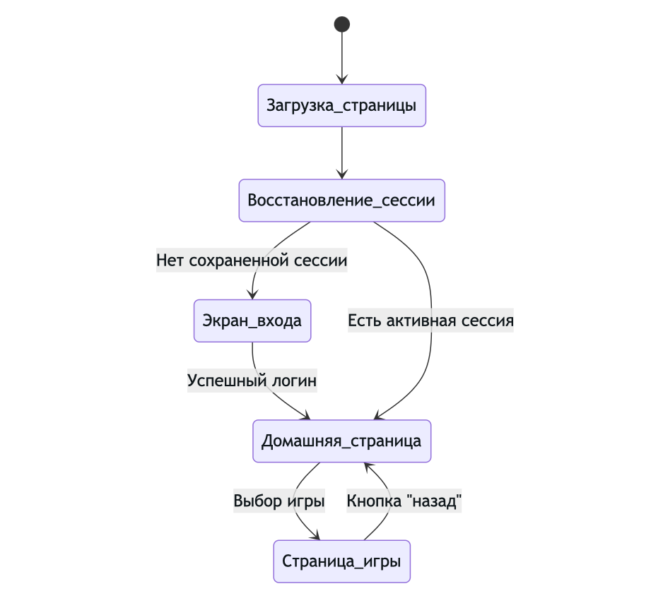
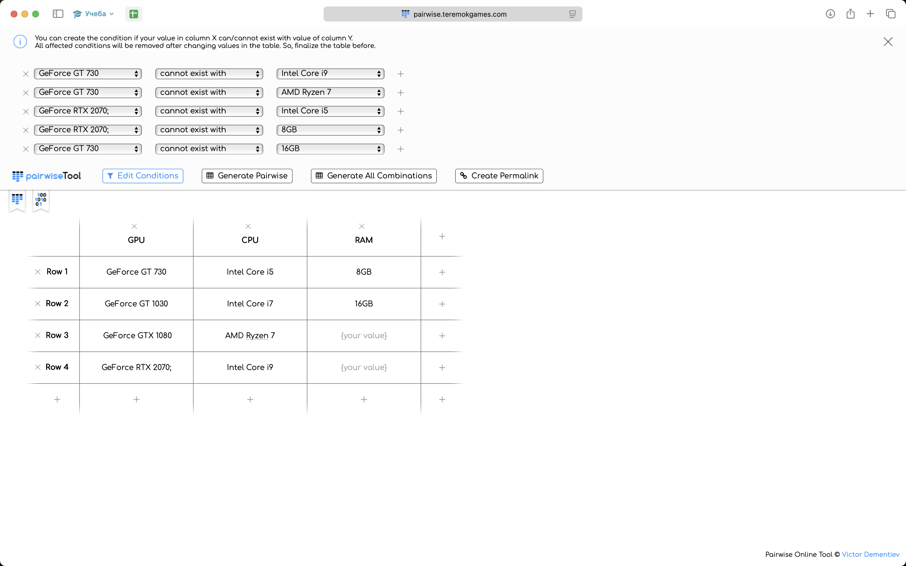

# Методики тестирования на основе черного ящика. Диаграммы состояний и переходов, попарное тестирование.

### Задание №1

Ответ: **Вариатн 3, переход Basket → Logout неверный**

### Задание №2

Код для диаграммы в __mermaid__

    [*] --> Загрузка_страницы
    Загрузка_страницы --> Восстановление_сессии
    Восстановление_сессии --> Экран_входа : Нет сохраненной сессии
    Экран_входа --> Домашняя_страница : Успешный логин
    Восстановление_сессии --> Домашняя_страница : Есть активная сессия
    Домашняя_страница --> Страница_игры : Выбор игры
    Страница_игры --> Домашняя_страница : Кнопка "назад"

### Задание №3

Была использована утилита allPairs

yaml кофиг:

    labels:
        - Os
        - SystemType
        - RAM
    parameters:
        - - WinXp
          - Win7
          - Win8
          - Win10
        - - x32
          - x64
        - - 4GB
          - 8GB
          - 16GB

---

**Выборка пар**
| #  | Os     | SystemType | RAM  |
|----|--------|------------|------|
| 1  | WinXp  | x64        | 8GB  |
| 2  | WinXp  | x32        | 16GB |
| 3  | WinXp  | x64        | 4GB  |
| 4  | Win7   | x64        | 16GB |
| 5  | Win7   | x64        | 4GB  |
| 6  | Win7   | x32        | 8GB  |
| 7  | Win8   | x64        | 8GB  |
| 8  | Win8   | x32        | 16GB |
| 9  | Win8   | x64        | 4GB  |
| 10 | Win10  | x64        | 16GB |
| 11 | Win10  | x32        | 4GB  |
| 12 | Win10  | x64        | 4GB  |
| 13 | Win10  | x32        | 8GB  |

---

**Список всех пар**
| #  | Os     | SystemType | RAM  |
|----|--------|------------|------|
| 1  | WinXp  | x32        | 4GB  |
| 2  | WinXp  | x32        | 8GB  |
| 3  | WinXp  | x32        | 16GB |
| 4  | WinXp  | x64        | 4GB  |
| 5  | WinXp  | x64        | 8GB  |
| 6  | WinXp  | x64        | 16GB |
| 7  | Win7   | x32        | 4GB  |
| 8  | Win7   | x32        | 8GB  |
| 9  | Win7   | x32        | 16GB |
| 10 | Win7   | x64        | 4GB  |
| 11 | Win7   | x64        | 8GB  |
| 12 | Win7   | x64        | 16GB |
| 13 | Win8   | x32        | 4GB  |
| 14 | Win8   | x32        | 8GB  |
| 15 | Win8   | x32        | 16GB |
| 16 | Win8   | x64        | 4GB  |
| 17 | Win8   | x64        | 8GB  |
| 18 | Win8   | x64        | 16GB |
| 19 | Win10  | x32        | 4GB  |
| 20 | Win10  | x32        | 8GB  |
| 21 | Win10  | x32        | 16GB |
| 22 | Win10  | x64        | 4GB  |
| 23 | Win10  | x64        | 8GB  |
| 24 | Win10  | x64        | 16GB |

### Задание №4

Была использована утилита Pairwise

---

**Выборка пар**
| #  | GPU                | CPU           | RAM  |
|----|--------------------|---------------|------|
| 1  | GeForce GT 730     | Intel Core i5 | 8GB  |
| 2  | GeForce GT 1030    | Intel Core i7 | 8GB  |
| 3  | GeForce GT 1030    | AMD Ryzen 7   | 16GB |
| 4  | GeForce GT 1030    | Intel Core i9 | 8GB  |
| 5  | GeForce GT 1030    | Intel Core i5 | 16GB |
| 6  | GeForce GTX 1080   | AMD Ryzen 7   | 8GB  |
| 7  | GeForce GTX 1080   | Intel Core i9 | 16GB |
| 8  | GeForce GTX 1080   | Intel Core i5 | 8GB  |
| 9  | GeForce GTX 1080   | Intel Core i7 | 16GB |
| 10 | GeForce RTX 2070   | AMD Ryzen 7   | 16GB |

---

**Список всех пар**
| #  | GPU                 | CPU           | RAM  |
|----|---------------------|---------------|------|
| 1  | GeForce GT 730      | Intel Core i5 | 8GB  |
| 2  | GeForce GT 730      | Intel Core i5 | 16GB |
| 3  | GeForce GT 730      | Intel Core i7 | 8GB  |
| 4  | GeForce GT 730      | Intel Core i7 | 16GB |
| 5  | GeForce GT 730      | AMD Ryzen 7   | 8GB  |
| 6  | GeForce GT 730      | AMD Ryzen 7   | 16GB |
| 7  | GeForce GT 730      | Intel Core i9 | 8GB  |
| 8  | GeForce GT 730      | Intel Core i9 | 16GB |
| 9  | GeForce GT 1030     | Intel Core i5 | 8GB  |
| 10 | GeForce GT 1030     | Intel Core i5 | 16GB |
| 11 | GeForce GT 1030     | Intel Core i7 | 8GB  |
| 12 | GeForce GT 1030     | Intel Core i7 | 16GB |
| 13 | GeForce GT 1030     | AMD Ryzen 7   | 8GB  |
| 14 | GeForce GT 1030     | AMD Ryzen 7   | 16GB |
| 15 | GeForce GT 1030     | Intel Core i9 | 8GB  |
| 16 | GeForce GT 1030     | Intel Core i9 | 16GB |
| 17 | GeForce GTX 1080    | Intel Core i5 | 8GB  |
| 18 | GeForce GTX 1080    | Intel Core i5 | 16GB |
| 19 | GeForce GTX 1080    | Intel Core i7 | 8GB  |
| 20 | GeForce GTX 1080    | Intel Core i7 | 16GB |
| 21 | GeForce GTX 1080    | AMD Ryzen 7   | 8GB  |
| 22 | GeForce GTX 1080    | AMD Ryzen 7   | 16GB |
| 23 | GeForce GTX 1080    | Intel Core i9 | 8GB  |
| 24 | GeForce GTX 1080    | Intel Core i9 | 16GB |
| 25 | GeForce RTX 2070    | Intel Core i5 | 8GB  |
| 26 | GeForce RTX 2070    | Intel Core i5 | 16GB |
| 27 | GeForce RTX 2070    | Intel Core i7 | 8GB  |
| 28 | GeForce RTX 2070    | Intel Core i7 | 16GB |
| 29 | GeForce RTX 2070    | AMD Ryzen 7   | 8GB  |
| 30 | GeForce RTX 2070    | AMD Ryzen 7   | 16GB |
| 31 | GeForce RTX 2070    | Intel Core i9 | 8GB  |
| 32 | GeForce RTX 2070    | Intel Core i9 | 16GB |
